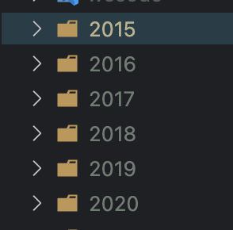
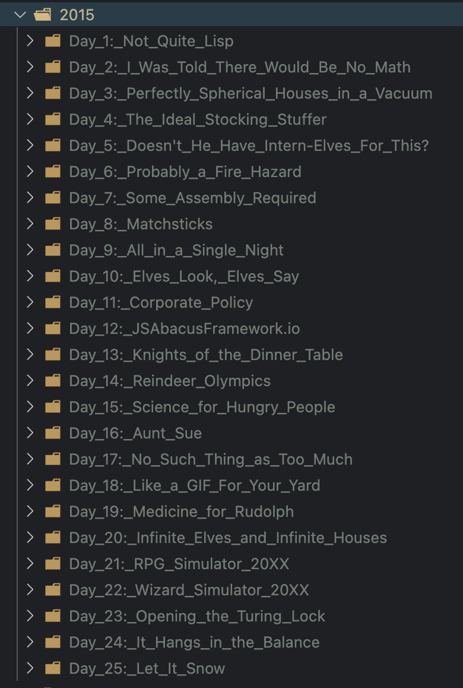
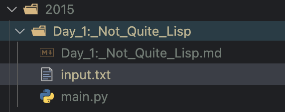
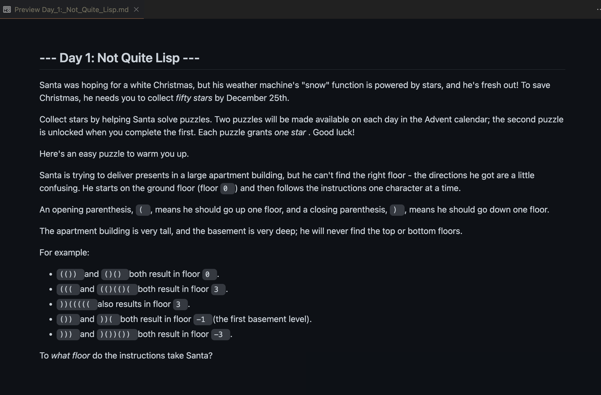

# Advent_puzzles_scraper

Web scraper- Directories generator to save  Advent of Code puzzles.

[Visit Advent of Code](https://adventofcode.com)

#### Why I created this repo

I created this scraper because I wanted a central place to not only work on the puzzles, but to also save my solutions.

Each year there are 25 puzzles, as well as 25 bonus puzzles for a total of 50. Thats a lot of puzzles to create a folder, and all the files, so I decided to automate it!

What this Repo currently does

- Creates directories for previous year puzzles
- Creates Sub folders for each puzzle inside each year directory.
- Creates txt file for puzzle input
- Creates md file populated with Puzzle instructions scraped from website.
- Creates a py file (For solving) :)

---

---

---

---

### What is Advent of Code?

[Visit Advent of Code](https://adventofcode.com)

Advent of code is a website created by Eric Wastl in 2015.

Every year on December 1st a new puzzle is released each day until December 25th.

These puzzles can be solved in any programming language and any skill level can play.
